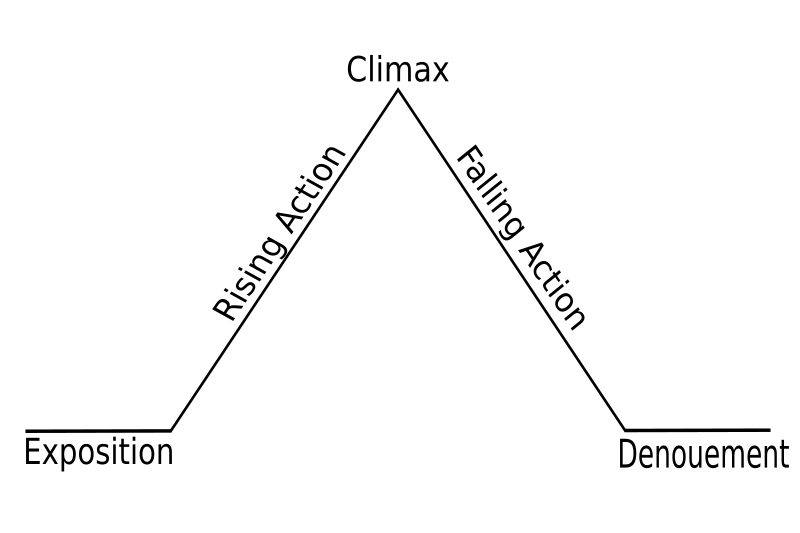

Nick Rutten
500502534
08 Mint
Project 2: Marc Stumpel

# Verhaalstructuren

## Drie-actstructuur

De drie-actstructuur is een model dat wordt gebruikt bij het schrijven van verhalen in drie aktes: setup, confontratie en ontknoping.

### Setup

In deze eerste akte worden de hoofdpersonen, hun relaties en de wereld waarin ze leven geschetst.

Later in de eerste akte vindt er een incident plaats dat de hoofdpersoon confronteert. Door zijn pogingen om met het incident om te gaan ontstaat er een nieuwe situatie die:

- het einde van de eerste akte aankondigt
- ervoor zorgt dat het leven van de hoofdpersoon nooit meer hetzelfde zal zijn.
- een dramatische vraag oplevert die beantwoordt zal worden in de ontknoping van de film.

### Confrontatie

De tweede akte laat meestal de pogingen van de hoofdpersoon om het incident uit de eerste akte op te lossen zien. De hoofdperson zal zich in steeds lastigere situaties vinden.

Meestal vindt in deze akte ook karakterontwikkeling plaats bij de hoofdpersoon, die nodig is om de problemen veroorzaakt door het incident op te kunnen lossen. Vaak gebeurd dit met hulp van mentors of mede-hoofdpersonen.

### Ontknoping

De derde akte laat het besluit van het verhaal en mogelijke andere subplots zien. Deze akte is vaak de meest intense wat betreft actie en laat de hoofdpersoon en andere karakters zich opnieuw definiëren als persoon.

## Dramatische Structuur (of Freytag's Piramide)

## Monomyth

## Bronnen

Three-Act Structure. (n.d.). Retrieved December 11, 2014, from http://www.indiana.edu/~audioweb/T206/three-act.html

Three-act structure - Wikipedia, the free encyclopedia. (n.d.). Retrieved December 11, 2014, from https://en.wikipedia.org/wiki/Three-act_structure
